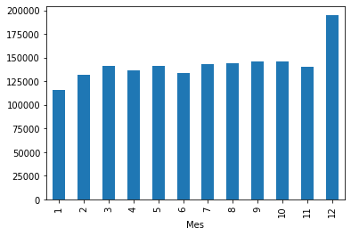

# Trabajo 4 Técnicas de Aprendizaje Estadístico

## Integrantes 
- Camilo Loaiza Fonnegra
- Juan Diego Marin Rodriguez
- Juan Pablo Rivera Sierra
- Eduardo Santos Ruiz
- Ivan Andrés Velasco Arias

## Introducción:

Se define como un sistema de información que permite registrar y mantener actualizada, centralizada, autorizada y validada la misma sobre los registros de automotores, conductores, licencias de tránsito, empresas de transporte público, infractores, accidentes de tránsito, seguros, remolques y semirremolques, maquinaría agrícola y de construcción autopropulsada y de personas naturales o jurídicas que prestan servicio al sector. (art. 8 y 9 de la Ley 769 de 2002 y la parte pertinente de la Ley 1005 de 2006). (Minstransporte,2021)

En Colombia, el Registro Único Nacional de Tránsito (RUNT), funciona como una gran base de datos centralizada en la que se almacena información sobre todos los vehículos del país, los conductores, los seguros de estos, las infracciones entre muchos más. El objetivo de este ejercicio será crear un modelo mediante el cual podamos predecir la cantidad de RUNT emitidos en un día cualquiera del año 2018 basado en la información histórica desde el año 2012 hasta 2017.

## Datos:

Nuestros datos iniciales se conforman por 2192 entradas que registran la cantidad de RUNT emitidos y la fecha de los mismos, en dos columnas llamadas ‘Unidades’ y ‘Fecha’ respectivamente, como se muestra a continuación:

## Variables explicativas

Las variables explicativas escogidas se construyeron a partir de la fecha, extrayendo de esta información como qué día de la semana es la fecha o si la fecha es un festivo o no, esto con el fin de tener más información que la que provee la fecha por si sola.

Dia: indica el día de la fecha.  
Dia_Semana: indica el día de la semana (0 = Lunes, 1 = Martes, 2 = Miércoles, 3 = Jueves, 4 = Viernes, 5 = Sábado, 6 = Domingo) de la fecha.  
Fin_Semana: indica si la fecha es o no un fin de semana.  
Mes: indica el mes de la fecha.	  
Inicio_Mes: indica si la fecha es o no el inicio del mes.  
Fin_Mes: indica si la fecha es o no el fin de mes.  
Anio: indica el año de la fecha.  
Inicio_Anio: indica si la fecha es o no el inicio del año.  
Fin_Anio: indica si la fecha es o no el fin del año.  
Dia_Anio: indica el día del año de la fecha.  
Semana_Anio: indica la semana del año de la fecha.  
Festivo: indica si la fecha es o no un día festivo.  

## Modelos utilizados

Se proponen los siguientes modelos para la predicción de los datos: 

### Bosques aleatorios

Para este modelo se obtuvieron los siguientes resultados: 

R2 entrenamiento: 0.9887  
R2 validación: 0.8740  
Diferencia entre ambos R2: 0.11470  

### Regresión lineal

Para este modelo se obtuvieron los siguientes resultados:   

R2 entrenamiento: 0.7709  
R2 validación: 0.6674  
Diferencia entre ambos R2: 0.1035  

### Regresión Lasso

Para este modelo se obtuvieron los siguientes resultados:   

R2 entrenamiento: 0.7654  
R2 validación: 0.6660  
Diferencia entre ambos R2: 0.0994  

### Redes neuronales 

Para este modelo se obtuvieron los siguientes resultados:   

R2 entrenamiento: 0.4213  
R2 validación: 0.2649  
Diferencia entre ambos R2: 0.1563  

### Máquinas de Soporte Vectorial enfocadas en regresión (SVR)
Para este modelo se obtuvieron los siguientes resultados:   

R2 entrenamiento: 0.3400  
R2 validación: 0.1635  
Diferencia entre ambos R2: 0.1764  

El modelo que se utiliza para el análisis descriptivo y la generación de archivos fue el modelo de bosques aleatorios, esto dado que su porcentaje de predicción en los datos de entrenamiento y validaciones superan con diferencia al resto de modelos.   

## Análisis Descriptivo

### Unidades por años

  
*Figura 1*. Unidades por años. Fuente propia.  

Se evidencia que a lo largo de los años ha ido decreciendo el número de personas que emiten el RUNT, esto a excepción del año 2014, el cual, comparando con los otros años es un dato atípico.  

### Unidades por semana

   
*Figura 2.* Unidades por semana. Fuente propia.  

La siguiente gráfica demuestra que los días en donde más personas emiten el RUNTson los días miércoles, jueves y viernes. Adicionalmente los sábados y los domingos se nota un bajo volumen de inscripción (los domingos el número baja estrepitosamente)  

### Unidades por mes 

  
*Figura 3.* Unidades por mes. Fuente propia.

Se nota un alto nivel de inscripciones en el mes de diciembre, sin embargo a lo largo de los otros meses en promedio se encuentran las inscripciones al mismo nivel. 

### Promedio fin de mes vs otros días por año 

  
*Figura 4.* Promedio fin de mes vs otros días por año. Fuente propia.

Se evidencia que en cada fin de mes aumenta la inscripción promedio de personas en el RUNT comparado con el resto de días en el mes a lo largo de los años (desde 2012 hasta 2017)

### Promedio inicio de mes vs otros días por año 

    
*Figura 5.* Promedio inicio de mes vs otros días por año. Fuente propia.

Se evidencia que en cada inicio de mes decrece la inscripción promedio de personas en el RUNT comparado con el resto de días en el mes a lo largo de los años (desde 2012 hasta 2017)

### Promedio fin de semana vs otros días por año 

      
*Figura 6.* Promedio fin de semana vs otros días por año. Fuente propia.

Se evidencia que en cada fin de semana es muy baja la inscripción promedio de personas en el RUNT comparado con el resto de días en el mes a lo largo de los años (desde 2012 hasta 2017)

### Promedio festivos vs otros días por año 

    
*Figura 7.* Promedio festivos vs otros días por año. Fuente propia.

Se evidencia que en cada festivo es casi nula la inscripción promedio de personas en el RUNT comparado con el resto de días en el mes a lo largo de los años (desde 2012 hasta 2017)

### Promedio de semanas en donde más se vende 

     
*Figura 8.* Promedio de semanas en donde más se vende. Fuente propia.

Se evidencia que en promedio la semana en donde más se realizan inscripciones del RUNT es la semana 51 y 52 del año, que es generalmente la semana donde está por llegar la navidad. 

## Conclusiones 
- En promedio, el modelo demuestra que enero es el mes en el que hay menor cantidad de inscripciones en el RUNT y diciembre, por el contrario, es el mes en que más se inscriben
- Los datos obtenidos en el año 2014 son atípicos dado que no muestra un decrecimiento de inscripciones que es como se comportan el resto de años 
- Para poder entrenar y realizar el modelo se tuvo que implementar la adición de columnas adicionales a los datos, tales como el año, la semana, si es fin de semana, si es festivo, si es fin de mes o si es inicio de mes. 
- El modelo utilizado para los análisis fue el modelo de bosques aleatorios por su porcentaje tan alto de predicción, 0.98 para datos de entrenamiento y  0.8740 para predicción

## Referencias:
(Minstransporte,2021) Mintransporte. (2009). ¿QUÉ ES EL RUNT? RUNT. https://www.runt.com.co/sobre-runt/que-es-runt  

(Agrawal, 2022) Agrawal, S. (2022, 7 enero). Feature Engineering of DateTime Variables for Data Science, Machine Learning, Python | Samarth Agrawal | Fast_ml | Towards Data Science. Medium. https://towardsdatascience.com/feature-engineering-of-datetime-variables-for-data-science-machine-learning-45e611c632ad  

GeeksforGeeks. (2021, 12 octubre). Vehicle Count Prediction From Sensor Data. https://www.geeksforgeeks.org/vehicle-count-prediction-from-sensor-data/  

Al-Ma’Amari, M. (2020, 9 junio). Deep Neural Networks for Regression Problems - Towards Data Science. Medium. https://towardsdatascience.com/deep-neural-networks-for-regression-problems-81321897ca33  

Scikit Learn. (s. f.). sklearn.linear_model.Lasso. https://scikit-learn.org/stable/modules/generated/sklearn.linear_model.Lasso.html#sklearn.linear_model.Lasso  

Scikit Learn. (s. f.-b). sklearn.svm.SVR. https://scikit-learn.org/stable/modules/generated/sklearn.svm.SVR.html  

